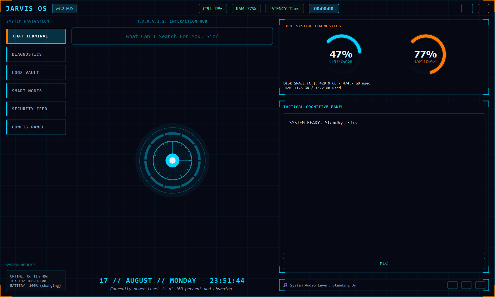

# JARVIS OS — Production AI Operating System & Autonomous Assistant


**JARVIS OS** is a production-grade personal AI operating system built with a modular Python backend, persistent SQLite database, multi-user authentication, controlled action registry, task manager, background reminder scheduler, encrypted notes vault, per-user file management, long-term memory, and a native PyQt6 Mission Control HUD interface.

---

## 📸 Actual Application Interface

Below is a screenshot captured directly from the running **JARVIS OS** desktop application:



---

## 🤖 What is JARVIS?

**JARVIS** (Just A Rather Very Intelligent System) is an autonomous, production-grade personal AI operating assistant designed to act as your centralized Mission Control for productivity, information retrieval, task automation, and system intelligence.

Unlike prototype chatbots or UI mockups, **JARVIS OS** is a **fully functional application** backed by a persistent SQLite database (`jarvis_production.db`). Every conversation, task, reminder, note, file record, and memory reflects 100% real application state with strict per-user data isolation.

---

## ⚡ What Can JARVIS Do?

### 1. Conversational AI & Context Persistence
- **Context-Aware Dialogue**: Maintains conversation context window across interactions. Powered by Google Gemini API with intelligent local fallback engines.
- **Persistent Chat History**: All messages and conversation threads are saved to SQLite (`chat_service.py`) and remain accessible across application restarts.

### 2. Controlled Action & Intent System
- **Safe Intent Routing**: Parses natural language requests into structured, type-checked actions (`command_system.py`) rather than executing arbitrary unsafe code.
- **Natural Language Triggering**: Understands commands such as `"task: submit quarterly report"`, `"remind me to inspect servers tomorrow"`, or `"note: API keys stored in env"`.

### 3. Task Management
- **Full Task Lifecycle**: Create, edit, complete, delete, search, and list tasks with priority levels (`low`, `medium`, `high`), due dates, and categories (`task_service.py`).
- **Zero Fake Data**: Displays true database state. If 0 tasks exist, a clean empty state is shown.

### 4. Background Reminder Scheduler & Notifications
- **Automated Reminder Daemon**: Runs a background scheduler thread (`reminder_service.py`) that monitors due dates and automatically fires alert notifications.
- **Notification Engine**: Stores unread alerts (`notification_service.py`) with read/unread status tracking.

### 5. Notes & Knowledge Vault
- **Encrypted Notes Manager**: Create, edit, organize, tag, search, and delete Markdown/text notes (`notes_service.py`).
- **Natural Language Saving**: Say or type `"note: emergency passcode 9988"` to persist notes instantly.

### 6. Secure File Vault & Document Indexing
- **Per-User File Isolation**: Isolated storage directory for each user (`jarvis-data/users/<user_id>/files/`).
- **Document Text Indexing**: Automatically extracts and indexes plain text from uploaded PDF, TXT, MD, PY, and JSON documents (`file_service.py`) for full-text search.

### 7. Web Search & Real-Time Telemetry
- **Wikipedia Retrieval**: Fetches real-time summary entries with clear source citations (`search_service.py`).
- **Satellite Weather Telemetry**: Queries Open-Meteo API for real-time weather, humidity, and wind telemetry.

### 8. Controlled Long-Term Memory
- **Explicit Memory Vault**: Store key-value facts, user preferences, and custom workflows (`memory_service.py`) with controls to view, delete, or clear memories.

### 9. Unified Global Search
- **Cross-Entity Search**: Search across messages, tasks, notes, uploaded files, and memories simultaneously (`global_search.py`).

### 10. Voice Assistant Engine
- **Speech-to-Text & Text-to-Speech**: Speech recognition and non-blocking PowerShell speech synthesis (`voice_service.py`) synchronized with the central Arc Reactor visualizer orb.

### 11. Security & Audit Logging
- **PBKDF2+SHA256 Auth**: Password hashing with unique 16-byte random salts per user (`auth_service.py`).
- **Biometric & PIN Overlay**: Lock screen modal with security PIN check and webcam intruder snapshot recording.
- **Comprehensive Audit Logs**: Every command and system operation is logged to `activity_logs` (`security.py`).

---

## 🛠 Project Architecture

```
Jarvis/
├── assets/
│   └── jarvis_actual_screenshot.png  # Actual native app screenshot
├── database.py           # SQLite connection pool, session manager, & schema
├── models.py             # Database ORM/table models
├── auth_service.py       # Password hashing, user registration, & session tokens
├── ai_service.py         # AI provider abstraction (Gemini / Local Fallbacks)
├── chat_service.py       # Conversation & message persistence
├── command_system.py     # Controlled AI action registry & intent parser
├── task_service.py       # Task CRUD, status tracking, & priority levels
├── reminder_service.py   # Reminder scheduling & background daemon thread
├── notification_service.py# System notification engine
├── notes_service.py      # Encrypted notes vault & full-text search
├── file_service.py       # Secure per-user file vault & text indexer
├── search_service.py     # Wikipedia, weather API, & web search retrieval
├── memory_service.py     # Controlled long-term memory engine
├── global_search.py      # Unified search across all user entities
├── security.py           # Input sanitization & audit logging
├── voice_service.py      # Asynchronous STT/TTS voice engine
├── jarvis.py             # Core Assistant Application & PyQt6 Mission Control HUD GUI
└── jarvis-data/          # SQLite database storage & per-user file directories
```

---

## 🚀 Getting Started

### Prerequisites
- Python 3.8+
- Required packages: `PyQt6`, `psutil`, `requests`, `pyautogui`, `SpeechRecognition`

```bash
pip install PyQt6 psutil requests pyautogui SpeechRecognition
```

### Running the Application

Launch the native desktop application directly:
```bash
python jarvis.py
```

---

## 🔗 Repository

GitHub Repository: [https://github.com/Karan174Pareek/Jarvis.git](https://github.com/Karan174Pareek/Jarvis.git)
